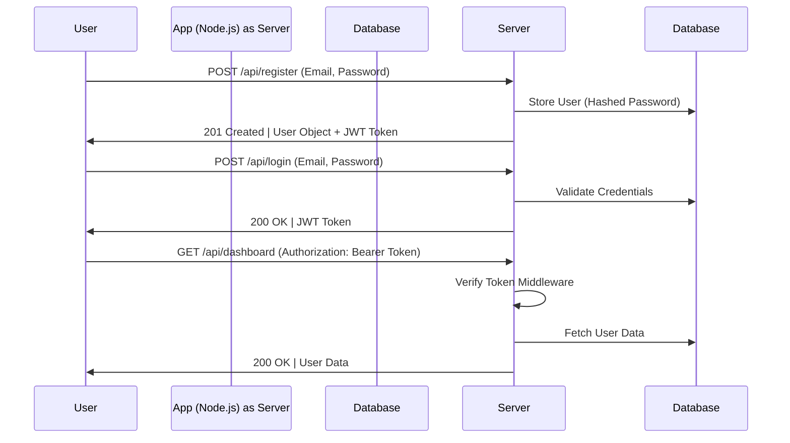

<h1 align="center">🛡️ Authentication System Documentation</h1>

**Built with Node.js & MongoDB**
**Version:** 1.0.0 | **Release Date:** [CURRENT DATE]

---

## **1. Overview**
This documentation outlines the implementation and architecture of a secure authentication system using **Node.js**, **MongoDB**, and **JWT (JSON Web Tokens)**. The system supports user registration, login, and protected API endpoints, ensuring data confidentiality and integrity.

---

### **2. Architecture Diagram**


---

## **3. Implementation Details**

### **3.1 Core Modules**
| Module           | Purpose                          | Packages Used               |
|------------------|----------------------------------|-----------------------------|
| **User Schema**  | Stores user data                 | `mongoose`, `bcryptjs`      |
| **Auth Service** | Handles user authentication      | `jsonwebtoken`, `dotenv`    |
| **Routes**       | Exposes endpoints                | `express`                   |
| **Middleware**   | Authenticates requests           | N/A                         |
| **Rate Limiting**| Prevents brute force attacks     | `express-rate-limit`        |
| **Helmet**       | Secures HTTP headers             | `helmet`                    |

---

### **3.2 Key Components**

#### **User Model**
```javascript
// models/User.js
const mongoose = require("mongoose");
const bcrypt = require("bcryptjs");

const UserSchema = new mongoose.Schema({
  email: { type: String, unique: true, required: true },
  password: { type: String, required: true },
});

UserSchema.pre("save", async function (next) {
  this.password = await bcrypt.hash(this.password, 12);
});

module.exports = mongoose.model("User", UserSchema);
```

#### **JWT Authentication Middleware**
```javascript
// middleware/auth.js
const jwt = require("jsonwebtoken");
require("dotenv").config();

module.exports = (req, res, next) => {
  const token = req.headers.authorization?.split(" ")[1];
  if (!token) return res.status(401).send("Unauthorized");

  jwt.verify(token, process.env.JWT_SECRET, (err, user) => {
    if (err) return res.status(403).send("Forbidden");
    req.user = user;
    next();
  });
};
```

#### **Rate Limiting Middleware**
```javascript
// middleware/rateLimit.js
const rateLimit = require("express-rate-limit");

const limiter = rateLimit({
  windowMs: 15 * 60 * 1000, // 15 minutes
  max: 100, // limit each IP to 100 requests per windowMs
  message: "Too many requests from this IP, please try again later."
});

module.exports = limiter;
```

#### **API Endpoints**
| Endpoint          | HTTP Method | Description               |
|-------------------|-------------|---------------------------|
| `/api/register`   | POST        | Register new user         |
| `/api/login`      | POST        | Log in existing user      |
| `/api/dashboard`  | GET         | Protected dashboard       |

---

## **4. Security Considerations**
1. **Password Hashing**: Uses `bcrypt` with a 12-round salt.
2. **JWT Tokens**: Configured for 1-hour expiration (`expiresIn: "1h"`).
3. **Rate Limiting**: Implements `express-rate-limit` to prevent brute force attacks.
4. **HTTPS**: Enforces secure communication using SSL/TLS certificates.
5. **Helmet**: Adds security headers to HTTP responses.

---

## **5. Testing & Validation**

### **Sample Request**
```curl
curl --request POST \
  --url http://localhost:3000/api/register \
  --header 'Content-Type: application/json' \
  --data '{
  "email": "mohamedaboelyazeed920@gmail.com",
  "password": "10203040!"
}'
```

```curl
curl --request POST \
  --url http://localhost:3000/api/login \
  --header 'Content-Type: application/json' \
  --data '{
    "email": "mohamedaboelyazeed920@gmail.com",
    "password": "10203040"
 }'
```

### **Expected Response**
```json
{
  "success": true,
  "token": "eyJhbGciOiJIUzI1NiIsInR5...jA6ntkQ6iijGPyV",
  "user": { "id": "65b9a...", "email": "mohamedaboelyazeed920@gmail.com" }
}
```

---

## **6. Deployment Checklist**
1. Set `NODE_ENV=production` in environment variables.
2. Use environment files for sensitive data (e.g., `JWT_SECRET`).
3. Optimize MongoDB query performance.
4. Enable API rate limiting in production.
5. Add HTTP security headers (e.g., `Content-Security-Policy`).
6. Ensure HTTPS is configured and enforced.

---

## **7. References**
- [RFC 2617: HTTP Authentication](https://datatracker.ietf.org/doc/html/rfc2617)
- [NIST Password Guidelines](https://pages.nist.gov/800-63-3/)
- [MongoDB Security Guide](https://www.mongodb.com/security)
- [Express Rate Limit](https://www.npmjs.com/package/express-rate-limit)
- [Helmet](https://www.npmjs.com/package/helmet)

---

### **About This Documentation**
- **Created By:** Mohamed Abolyazeed
- **Last Updated:** [DATE]
- **Purpose:** Guide developers in implementing a secure authentication system.

Contact support@yourdomain.com for additional inquiries.

send message with email use template URL ==> https://react.email/templates

resend api key URL ==> https://resend.com/api-keys/e5e7e018-f3df-497d-a7ff-c02259c98e6a